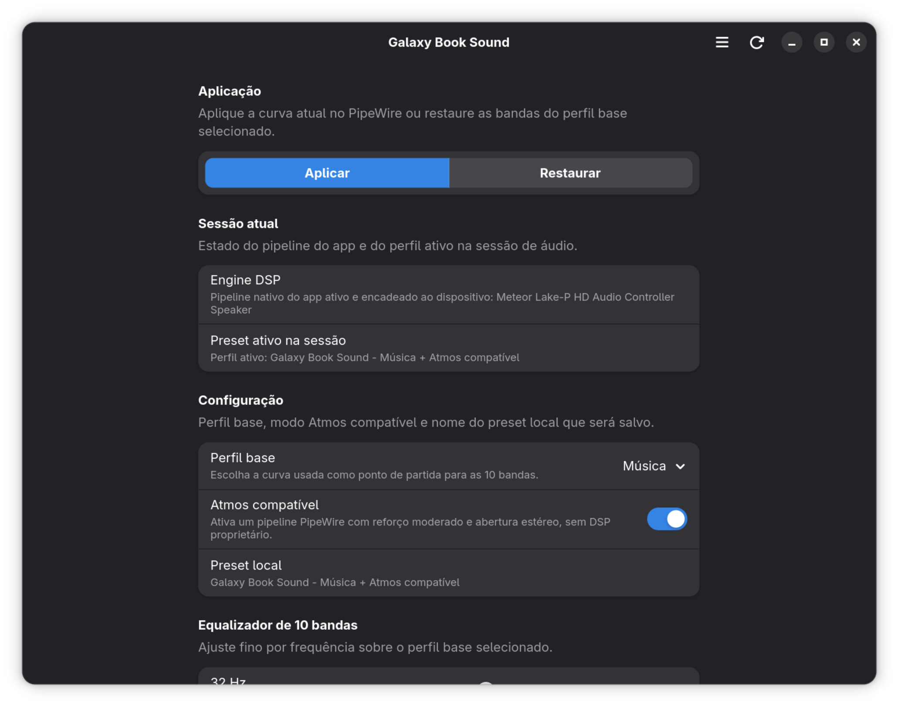
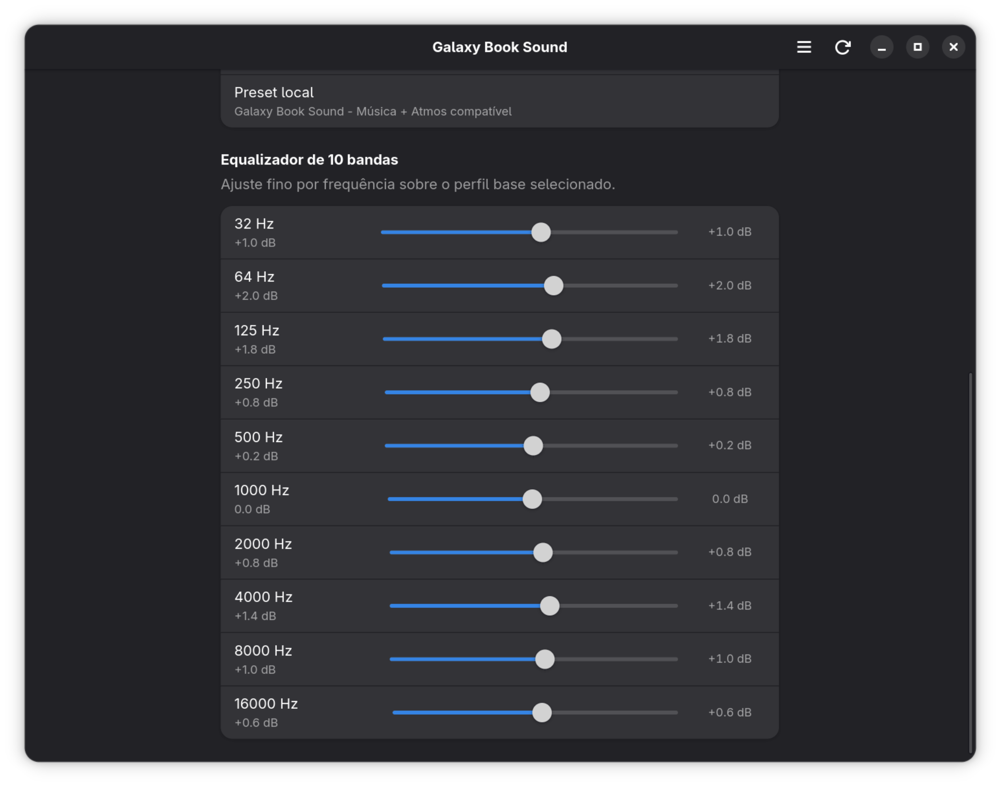
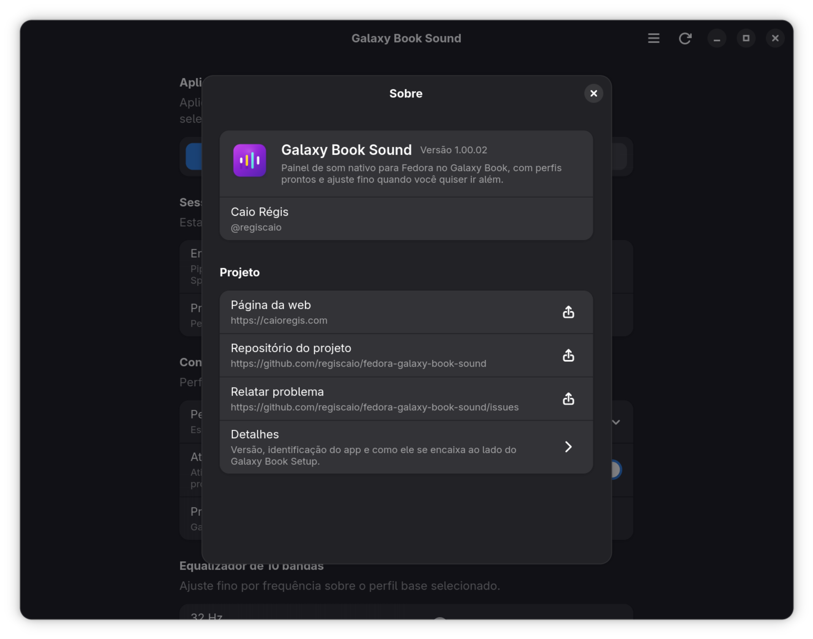

<p align="center">
  
</p>

<h1 align="center">Galaxy Book Sound</h1>

<p align="center">
  <a href="README.md">🇧🇷 Português</a>
  <a href="README.en.md">🇺🇸 English</a>
  <a href="README.es.md">🇪🇸 Español</a>
  <a href="README.it.md">🇮🇹 Italiano</a>
</p>

## Instalação rápida

Para instalar o app a partir do repositório DNF público:

```bash
sudo dnf config-manager addrepo --from-repofile=https://packages.caioregis.com/fedora/caioregis.repo
sudo dnf install galaxybook-sound
```

Se você também quiser o auxiliar gráfico de instalação, validação e
diagnóstico do notebook:

```bash
sudo dnf install galaxybook-setup
```

`Galaxy Book Sound` é um app de som para Fedora nos notebooks Samsung Galaxy
Book, com foco atual no **Galaxy Book4 Ultra**. O app tem UI nativa do GNOME
com `GTK4` e `libadwaita`, e foi pensado para funcionar junto do suporte de
alto-falantes empacotado em
[`fedora-galaxy-book-max98390`](https://github.com/regiscaio/fedora-galaxy-book-max98390).

Este repositório cobre o **lado userspace** do ajuste de áudio: equalizador,
perfis e o modo `Atmos compatível` para os alto-falantes internos. Instalação
assistida, validação do ambiente e diagnósticos gerais do notebook ficam no
[`fedora-galaxy-book-setup`](https://github.com/regiscaio/fedora-galaxy-book-setup).

## Interface atual

### Tela principal



### Equalizador de 10 bandas



### Modal `Sobre`



## Escopo

O projeto entrega:

- perfis base `Neutro`, `Música` e `Cinema`;
- equalizador de 10 bandas com ajuste manual;
- modo `Atmos compatível` com ativação e desativação pelo próprio app;
- opção de `Saída combinada` para duplicar o áudio processado em todas as
  saídas disponíveis;
- interface em página única no padrão de preferências do GNOME;
- configuração persistida pelo próprio app para o fluxo de áudio interno.

Este projeto **não** entrega:

- instalação de drivers, módulos ou serviços do stack de áudio;
- diagnóstico de hardware ou do stack de áudio do host;
- Dolby Atmos proprietário.

O `Galaxy Book Setup` continua sendo o caminho recomendado para instalação
assistida e validação do host. O suporte MAX98390 continua no
[`fedora-galaxy-book-max98390`](https://github.com/regiscaio/fedora-galaxy-book-max98390).

## Como o app aplica o som

No uso diário, a ideia do app é simples: você ajusta o perfil, liga ou desliga
o modo `Atmos compatível`, decide se quer usar a `Saída combinada`, faz o
fine-tuning do equalizador e aplica a configuração sem sair do fluxo nativo do
GNOME.

Por baixo, o app mantém sua própria configuração de áudio para os
alto-falantes internos do notebook. Na prática, isso significa:

- equalizador, perfis, modo `Atmos compatível` e preferência de saída
  combinada persistidos pelo próprio app;
- aplicação transparente na saída interna depois de reiniciar a sessão de
  áudio, ou em uma saída combinada quando esse modo estiver ativo;
- separação clara entre o app de uso diário e o restante do stack do sistema.

Tecnicamente, isso hoje é feito com um `filter-chain` próprio em
`~/.config/pipewire/pipewire.conf.d/`, aplicado pela política de `smart
filters` do `WirePlumber`. Quando a `Saída combinada` está ativa, o app
também cria um sink virtual com `libpipewire-module-combine-stream` e o usa
como destino do pipeline.

## Build e empacotamento

Dependências de build no Fedora:

```bash
sudo dnf install cargo rust pkgconf-pkg-config gtk4-devel libadwaita-devel
```

Se o host não tiver o toolchain completo, o `Makefile` usa um container
rootless com `podman`.

Comandos principais:

```bash
make build
make test
make smoke-test
make dist
make srpm
make rpm
```

O binário gerado localmente fica em:

```bash
./target/release/galaxybook-sound
```

O launcher local de desenvolvimento pode ser instalado com:

```bash
make install-local
```

Arquivos relevantes:

- spec RPM: [`packaging/fedora/galaxybook-sound.spec`](packaging/fedora/galaxybook-sound.spec)
- launcher: [`data/com.caioregis.GalaxyBookSound.desktop`](data/com.caioregis.GalaxyBookSound.desktop)
- metadados AppStream: [`data/com.caioregis.GalaxyBookSound.metainfo.xml`](data/com.caioregis.GalaxyBookSound.metainfo.xml)

O pacote RPM acompanha só o que o app realmente usa. O backend de áudio do
projeto fica no próprio app, via `filter-chain` em `PipeWire`.

## Licença

Este projeto é distribuído sob a licença **GPL-3.0-only**. Veja o arquivo
[LICENSE](LICENSE).
